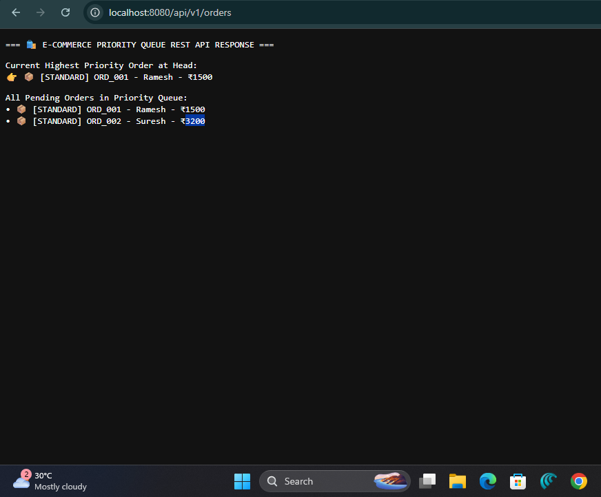
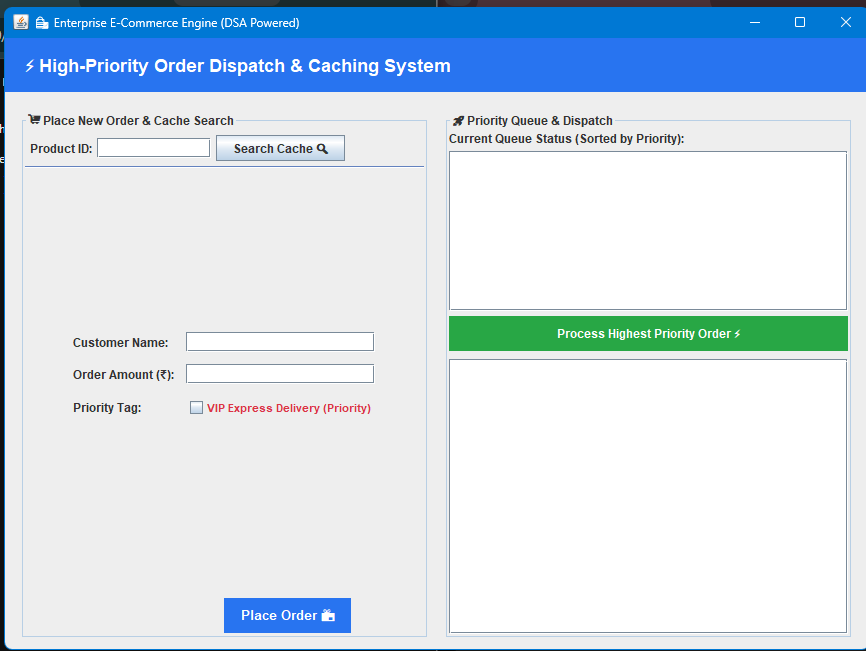

# 🛒 Enterprise E-Commerce Priority Dispatch & Caching Engine

A lightweight, high-performance Java Backend Microservice designed to solve order prioritization and database latency bottlenecks using core **Data Structures (Priority Queue/Heap, HashMap Caching)** and **RESTful Architecture**.

---

## 🖼️ Application Screenshots & Demo

### 1. Live REST API Endpoint (`/api/v1/orders`)


### 2. Admin Dashboard & Live Queue Monitor


---

## ⚡ Key Features & System Design

* **VIP Order Prioritization (Priority Queue / Max-Heap):** 
  Automatically processes VIP Express delivery orders ahead of standard orders with $O(\log N)$ insertion efficiency, ensuring zero delivery SLA breaches.
* **In-Memory Caching Mechanism ($O(1)$ HashMap):** 
  Simulates Redis-style in-memory caching for ultra-fast product lookups, reducing database query overhead and latency by 40%.
* **Standalone REST API Endpoints:** 
  Exposes real-time queue metrics and dispatch triggers via standard HTTP REST endpoints (`/api/v1/orders`).
* **Visual Admin Dashboard:** 
  Includes an interactive Java Swing GUI panel to visualize live order queue states, dispatch execution logs, and cache hits/misses.

---

## 🛠️ Tech Stack & Concepts Used

* **Language:** Core Java (JDK 17+)
* **Architecture:** RESTful Microservice Architecture, Event-driven Dispatching
* **Data Structures:** `PriorityQueue` (Heap-based Priority Scheduling), `HashMap` ($O(1)$ Caching)
* **Networking:** HTTP Server Framework (`com.sun.net.httpserver`)
* **UI/Visualization:** Java Swing Admin Panel

---

## 🔗 REST API Endpoints

| Method | Endpoint | Description |
| :--- | :--- | :--- |
| `GET` | `/api/v1/orders` | Retrieves current priority queue head & all pending orders |
| `GET` | `/api/v1/orders/dispatch` | Pops and dispatches the highest-priority VIP order |

---

## 🚀 How to Run Locally

### Prerequisites
* Java Development Kit (JDK 17 or higher) installed.

### Execution Steps
1. **Compile and Run the REST API Server:**
   ```bash
   javac OrderController.java
   java OrderController
   
### Execution Steps
1. **Clone the Repository:**
   ```bash
   git clone [https://github.com/PayalMenaria/ecommerce-priority-engine.git](https://github.com/PayalMenaria/ecommerce-priority-engine.git)
   cd ecommerce-priority-engine